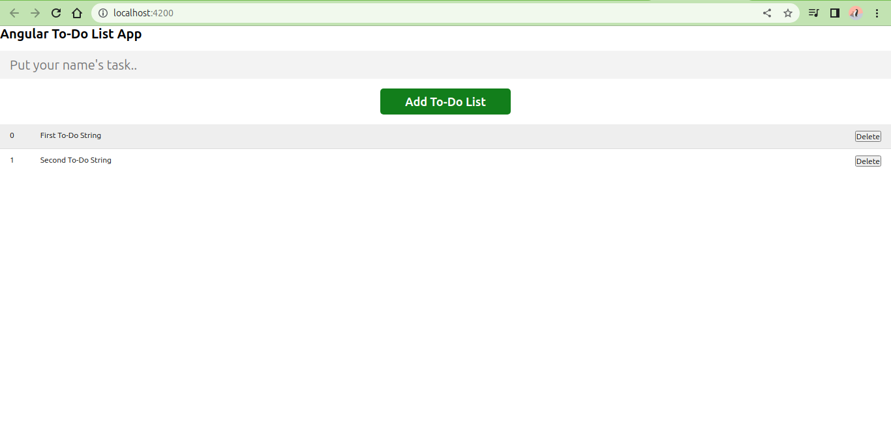
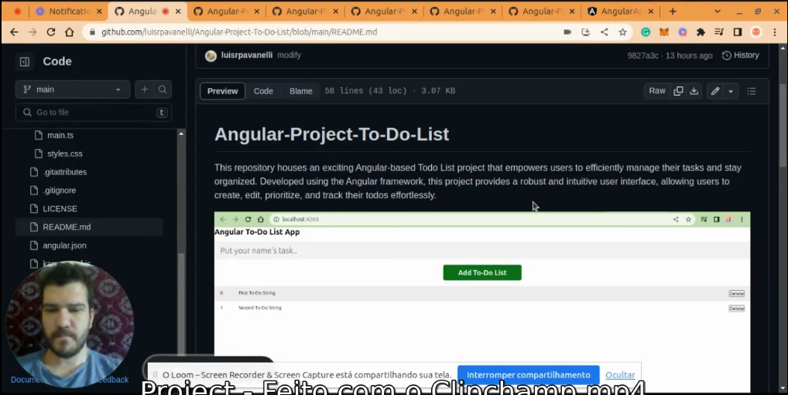

# Angular-Project-To-Do-List
 This repository houses an exciting Angular-based Todo List project that empowers users to efficiently manage their tasks and stay organized. Developed using the Angular framework, this project provides a robust and intuitive user interface, allowing users to create, edit, prioritize, and track their todos effortlessly.

# Project Description
AngularTodo is a powerful to-do list management application built with Angular. It offers a seamless and intuitive user interface for efficiently managing your tasks. This README provides essential information to get started with the project.

# Development server
To run the application locally and access it in your web browser, follow these steps:

Ensure that you have Node.js and npm installed on your system.
Open a terminal or command prompt in the root directory of the project.
Run the command npm install to install the project dependencies.
Once the installation is complete, run ng serve to start the development server.
Open your preferred web browser and navigate to http://localhost:4200/.
The application will automatically reload whenever you make changes to the source files.

# Code scaffolding
Angular CLI provides a convenient way to generate different components. To generate a new component, use the following command:

Copy code
ng generate component component-name
You can also use other generation commands such as ng generate directive|pipe|service|class|guard|interface|enum|module based on your project requirements.

# Build
To build the AngularTodo project, follow these steps:

Open a terminal or command prompt in the root directory of the project.
Run the command ng build to build the project.
The build artifacts will be stored in the dist/ directory.
You can then deploy the contents of the dist/ directory to a web server of your choice.

# Running unit tests
AngularTodo includes unit tests to ensure the reliability and correctness of the application. To execute the unit tests, use the following command:

bash
Copy code
ng test
This command will execute the unit tests using the Karma test runner.

# Running end-to-end tests
End-to-end tests are crucial for testing the complete functionality of the application. To execute the end-to-end tests, follow these steps:

Open a terminal or command prompt in the root directory of the project.
Run the command ng e2e to execute the end-to-end tests.
This command will use a platform of your choice for executing the tests.
Please note that you might need to add a package that implements end-to-end testing capabilities before running this command.

# Further help
For further assistance or more detailed information about the Angular CLI, you can use the following command:

bash
Copy code
ng help
Additionally, you can refer to the Angular CLI Overview and Command Reference page for comprehensive documentation and usage instructions.

If you encounter any issues or have specific questions regarding AngularTodo, please consult the project documentation or seek support from the project maintainers.